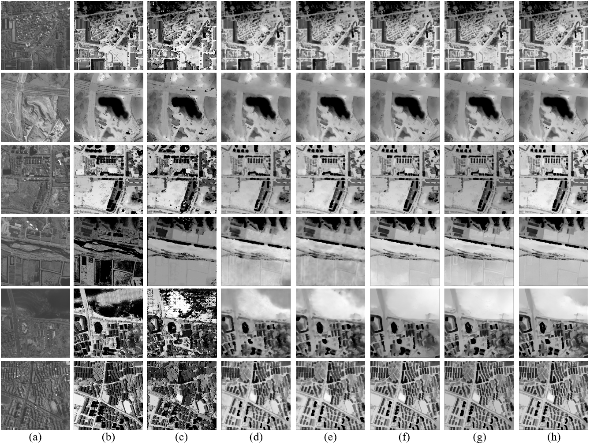
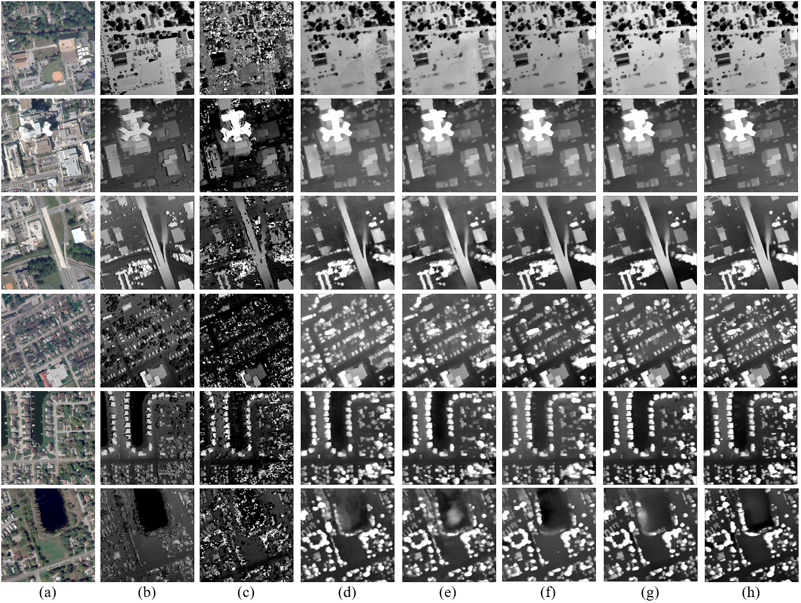

# MSGEV-TJGNet
This is the official code for MSGEV-TJGNet.
## Requirements

```python==3.8```

```einops==0.3.0```

```cryptography==43.0.0```

```torch==2.3.0```

```numpy==1.24.4```

```pandas==2.0.3```

```opencv-python==4.4.0.46```

## Visualization

### Visualization on WHU-Stereo dataset


(a) left image. (b) disparity ground truth. (c) SGM. (d) PSMNet. (e) HMSMNet. (f) RAFT. (g) DLNR. (h) Ours.

### Visualization on US3D dataset


(a) left image. (b) disparity ground truth. (c) SGM. (d) PSMNet. (e) HMSMNet. (f) RAFT. (g) DLNR. (h) Ours.

## Dataset Preparation
* [WHU-Stereo](https://github.com/Sheng029/WHU-Stereo)
* [US3D](https://ieee-dataport.org/open-access/data-fusion-contest-2019-dfc2019)
  
  Note：If you want to use our preprocessed US3D dataset, please download：

## Pretrained weights
The pretrained weights for WHU-Stereo and US3D datasets are available at:

https://pan.baidu.com/s/1uuZl9WvSpLw6wgNkq9-kTA password: 4k7j

Please place them in the main directory.

## Evaluation on WHU-Stereo
```Shell
python evaluate_WHU.py --test_left_dir dataset/WHU-Stereo/with_GT/test_all/left --test_right_dir dataset/WHU-Stereo/test_all/right --test_disp_dir dataset/WHU-Stereo/test_all/disp --test_save_path results/whu --device cuda
```
```test_left_dir```: Directory containing the left image

```test_right_dir```: Directory containing the right image

```test_disp_dir```: Directory containing the disparity ground truth

The results will be:

```Shell
EPE: 1.586  D1:12.63%
```

## Comparsion with other methods
The best score for each metric is marked in **bold**.
|Method       |  EPE(Px)  |  D1(%) |
|-------------|-----------|--------|
|SGM          |  4.989    |  36.22 |
|PSMNet       |  2.183    |  21.95 |
|HMSMNet      |  2.040    |  19.00 |
|RAFT         |  1.729    |  14.12 |
|DLNR         |  1.864    |  16.56 |
|Ours         |**1.586**  |**12.63**|

## Evaluation on US3D
```Shell
python evaluate_US3D.py --test_left_dir dataset/US3D/test_all/left --test_right_dir dataset/US3D/test_all/left --test_disp_dir dataset/US3D/test_all/left --test_save_path results/us3d --device cuda
```
```test_left_dir```: Directory containing the left image

```test_right_dir```: Directory containing the right image

```test_disp_dir```: Directory containing the disparity ground truth

The results will be:

```Shell
EPE: 1.313  D1:7.17%
```

## Comparsion with other methods
The best score for each metric is marked in **bold**.
|Method       |  EPE(Px)  |  D1(%) |
|-------------|-----------|--------|
|SGM          |  2.398    |  19.93 |
|PSMNet       |  1.499    |  9.22 |
|HMSMNet      |  1.473    |  9.17 |
|RAFT         |  1.366    |  7.72 |
|DLNR         |  1.389    |  8.03 |
|Ours         |**1.313**  |**7.17**|


## Test on your own image!
The following command is provided to allow you to test your own dataset! We give an example:
```Shell
python evaluate_single.py --left_path KM_left_0.tiff --right_path KM_right_0.tiff --save_path KM_pred_0.tiff --mode 16bit device cuda
```
```mode```: 16bit(single channel) or 8bit(RGB 3 channels) 

The result will be saved at 'KM_pred_0.tiff'!

## Good luck!
Thank you for using our code!
